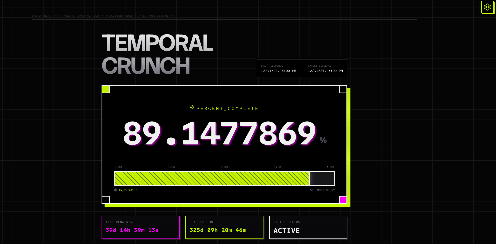
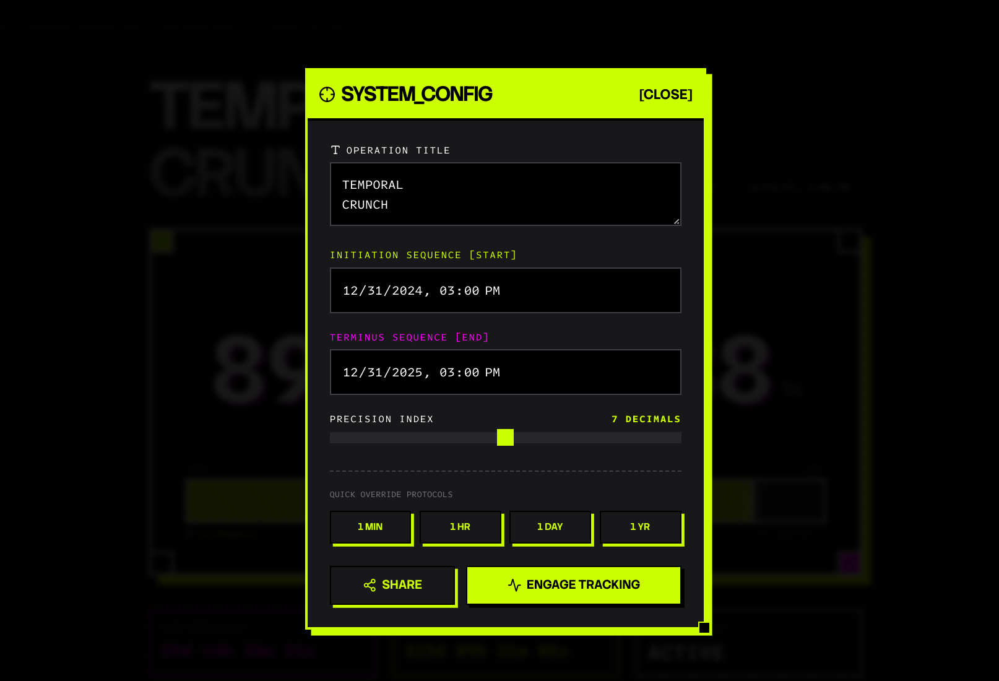

# `CRONOCRUNCH`

A neo-brutalist, shareable (via URL carrying a handful of configuration payloads), high-precision temporal progress tracker featuring cyberpunk aesthetics and hard-style animations. Visualize the passage of time with millisecond precision in a raw, industrial interface.




## // FEATURES

*   **High-Precision Tracking**: Monitor time progression with up 0 to 14 decimal places of precision.
*   **Dynamic Configuration**: Customize the operation title, start time, and end time to track any event or duration.
*   **URL State Persistence**: Share your specific countdowns with others. All configuration data is stored in the URL.
*   **Quick Presets**: Instantly set trackers for the next minute, hour, day, or year.
*   **Aesthetic**:
    *   Acid/Neon color palette.
    *   CRT scanline and flicker effects.
    *   Responsive, grid-based layout.
    *   Monospaced typography (Intel One Mono).

## // USAGE

1.  **Configure**: Click the **Settings** (gear icon) to open the configuration panel.
2.  **Customize**: Enter your "Operation Title", "Initiation Sequence" (Start), and "Terminus Sequence" (End).
3.  **Refine**: Adjust the "Precision Index" slider to control the number of decimal places.
4.  **Share**: Click the **SHARE** button to copy the unique URL for your tracker.

## // RUN LOCALLY

It's so dead simple.

**Prerequisites:** Node.js

1.  Install dependencies:
    ```bash
    npm install
    ```
2.  Run the app:
    ```bash
    npm run dev
    ```

---
*Reality is loading...*
<br>
*Or your dream days, maybe.*
